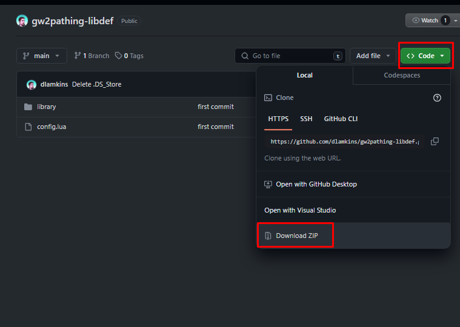
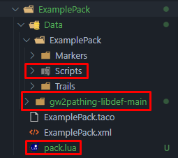

import Tabs from '@theme/Tabs';
import TabItem from '@theme/TabItem';

So you want to start scripting, huh? Great! This guide will help you get on your feet and start scripting .

## Setup
Before you can just jump into trying out scripting, there's a tiny bit of setup to be done.
You need to:
- Install an IDE
- Set up your pack structure
- Download the Pathing API Library
- Set up your `pack.lua` file
<br/>
---

### Your IDE
An Integrated Development Environment (IDE) is a program that helps you write code. There are many different IDEs out there, and ultimately it comes down to personal preference, but I'm going to recommend Visual Studio Code since it's lightweight and pretty user-friendly, and that's what I'll be using in the various screenshots you'll see throughout the tutorial.  

If all of this sounds like gibberish to you, don't worry, it's not as complicated as it sounds. Basically an IDE is just a fancy text editor.

If you don't already have VSCode, you can download it [here](https://code.visualstudio.com/).

:::tip
You can install the Lua extension by searching for "Lua" in the extensions tab of VSCode.  
This will give you syntax highlighting and code completion for Lua when paired with the API library.
:::

Once you have it installed, you can open your pack's folder as the workspace and we're ready to move on to the next step.

### Pack Structure
If you haven't already set up your pack structure, you should do that now.

In order to do any scripting, we need to add a few things to your existing pack structure:
- In your pack's root folder, create a new file called `pack.lua`. We'll dive into this more in just a bit.
- Somewhere in your pack's `/Data` folder, create a new folder called `Scripts`. The exact location is up to you, but I recommend putting it in `/Data/YourPackName/Scripts`. This is where you will put all of your Lua scripts.

### Pathing API Library
The Pathing API Library is a library containing information about the API, which allows for code completion and syntax highlighting in your editor.  

You can download it [here](https://github.com/dlamkins/gw2pathing-libdef). 
- Click the green `Code` button and select `Download ZIP`.  

- Move the zip file into your pack's `/Data` folder and extract it there.
- If done correctly, you should end up with a folder called `gw2pathing-libdef-main` containing `config.lua` and a `library` folder inside your `/Data` folder. After setting all of this up, your pack's folder structure should look something like this:  


:::tip
If your pack is setup as a GitHub repository, you might want to add the `gw2pathing-libdef-main` folder to your `.gitignore` file to avoid committing it to your repository.
You also don't need to include this folder in releases.
:::
:::note
Alternatively, you can set up the library as a submodule in your repository. This way, you can easily update the library by pulling the latest changes from the main repository, but that's something for another tutorial.
:::
<br/>
---

## pack.lua
The `pack.lua` file is the entry point for your pack's scripts. This is the file that tells the Pathing module what scripts to load and when to load them. It's also where you can define global variables and functions that you want to be accessible from all of your scripts. There are two key components to the `pack.lua` file:
- The global pack table - This is a table that will be accessible from all of your scripts. Other scripts can add their own tables to this table, and you can access them from other scripts.
- The `Pack:Require` function - This function is used to load all other scripts, in the order that they are required. This function takes a single argument, which is the path to the script you want to load.

Here's a basic example of what a `pack.lua` file might look like:
<Tabs>
    <TabItem value="pack" label="pack.lua" default>
        ```lua title="pack.lua"
        -- This is a global table that will be accessible from all of your scripts
        ExamplePack = {
            -- This is a global variable that can be accessed from all of your scripts via ExamplePack.Version
            Version = "1.0.0"
        }

        Debug:Print("Loading ExamplePack Version: " .. ExamplePack.Version)

        Pack:Require("Data/ExamplePack/Scripts/script1.lua")

        -- Note, this has to be after the Pack:Require call or it will not exist yet
        Debug:Print(ExamplePack.Script1.Message)
        ```
    </TabItem>
    <TabItem value="script1" label="script1.lua">
        ```lua title="script1.lua"
        -- This is a global table that will be accessible from all of your scripts
        ExamplePack.Script1 = {
            -- This is a global variable that can be accessed from all of your scripts via ExamplePack.Script1.Message
            Message = "Hello from script1.lua"
        }

        if ExamplePack.Version == "1.0.0" then
            Debug:Print("Version is 1.0.0")
        end
        ```
    </TabItem>
    <TabItem value="output" label="Output">
        ```
        Loading ExamplePack Version: 1.0.0
        Version is 1.0.0
        Hello from script1.lua
        ```
    </TabItem>
</Tabs>

You can also do other logic inside of your `pack.lua` file, but it's recommended to do any heavy lifting in separate scripts. 

Now that we have our pack set up and an entry point, we can start writing some scripts!